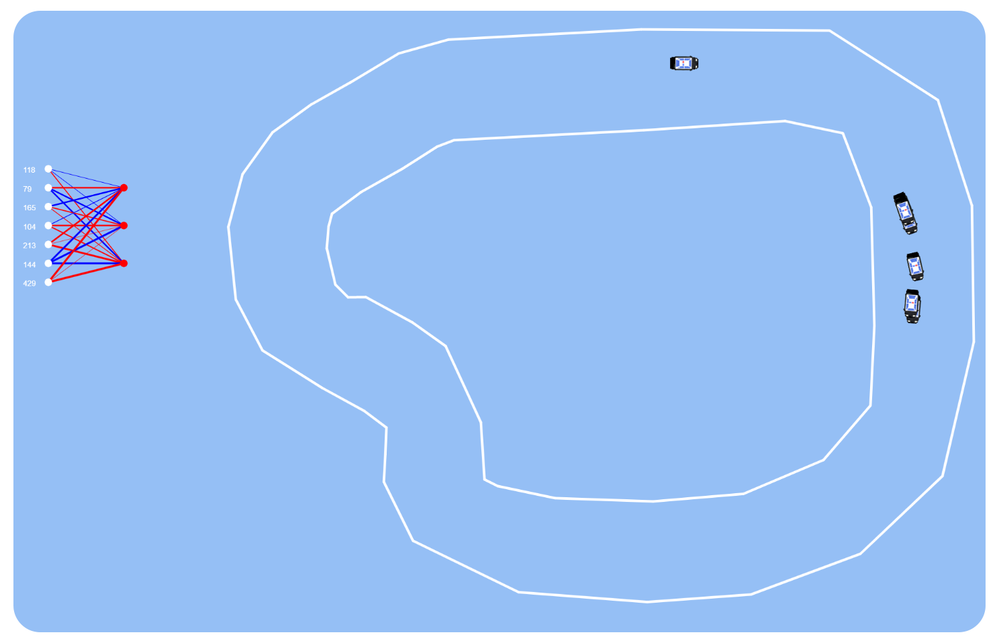

# 🚗 Car AI

**💡 This project is an Artificial Intelligence learning to drive a car from scratch (no knowledge of how to go forward, turn, nothing).**

	

# ❓ How to use

You can try the AI **[here](maximus220.github.io/car-ai/)**. Or clone and start it via a local server.
  
⚠️ This project has been made to work on **computer only**, besides, it is **recommended to unzoom** for a complete experience *(-75% using CTRL + down mousewheel)* ⚠️

# 🧠 How it works

This AI learns through **[NEAT (Neuro Evolution by Augmenting Topologies)](https://nn.cs.utexas.edu/downloads/papers/stanley.ec02.pdf)**. This NEAT implementation has entirely been made by me.
  
A simple way to explain NEAT is to compare it to human evolution, the NEAT algorithm uses the natural selection to improve its creatures, and pass to the next generations the best brain configuration possible.

# ⚙️ Options
This program allows for a lot of different options to try all the potential of the AI:

* **Draw your race** : You can draw your own race by creating a maximum of points (be careful not to overlap) making a loop shape. *(Click the "finish race" button that appears when you draw a point next to the first one to finalize)*
* **NEAT parameters** : You can change the number of creatures to accelerate or slow down the learning process (will improve performances). If the AI gets stuck you can also increase the learning rate (or restart if you prefer) that will allow for a faster but more random learning.
* **Saving options** : You can save the AI's brain by clicking "Get current best creature", you will be given a long list of number that represents the AI"s brain, you can then load it by pasting it and clicking "Make generation from creature".

# 🖼️ Demo

	

	

